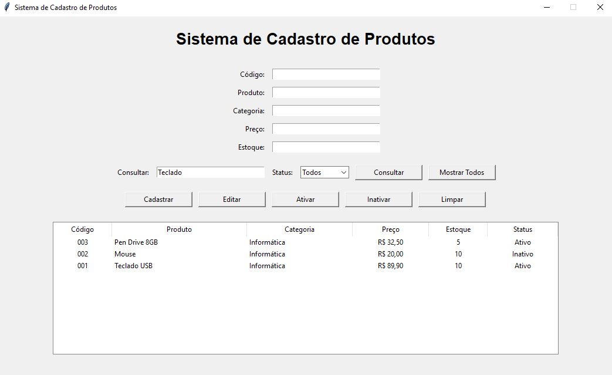
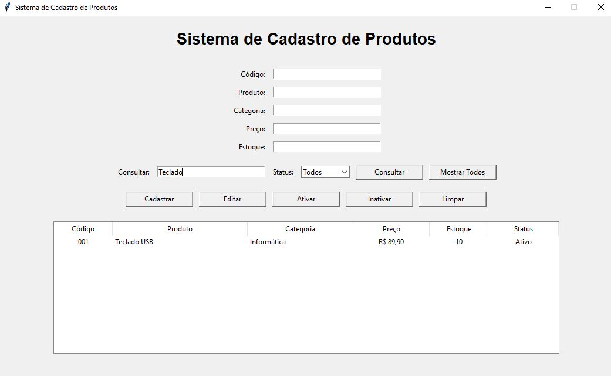
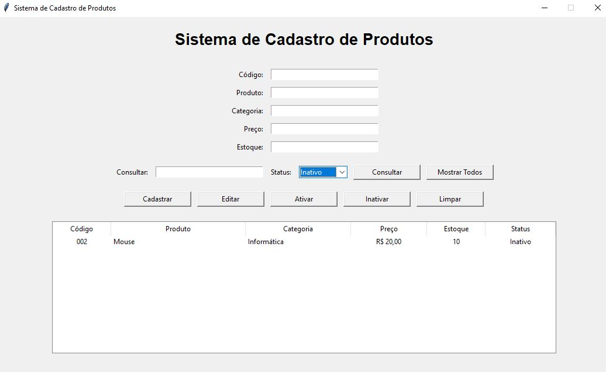

# Sistema de Cadastro e Consulta de Produtos

Aplicação desktop desenvolvida em Python para cadastro, consulta e gerenciamento de produtos, utilizando SQLite como banco de dados e Tkinter para construção da interface gráfica.

O projeto foi desenvolvido com foco em demonstrar conhecimentos práticos em **Python, SQL, banco de dados relacionais, operações CRUD e desenvolvimento de interfaces desktop**.

---

## Objetivo

Desenvolver um sistema simples e funcional para gerenciamento de produtos, permitindo controlar informações básicas de cadastro e seu status no sistema.

O projeto também demonstra a integração entre uma aplicação Python e um banco de dados SQLite.

---

## Tecnologias utilizadas

* Python
* Tkinter
* SQLite
* SQL
* Git / GitHub

---

## Funcionalidades

* Cadastro de produtos
* Consulta por código ou nome
* Filtro por status
* Edição de produtos
* Ativação de produtos
* Inativação de produtos
* Controle de preço e estoque
* Validação dos dados informados
* Persistência das informações em banco de dados SQLite

---

## Estrutura do banco de dados

A aplicação utiliza uma tabela chamada `produtos`, contendo os seguintes campos:

| Campo     | Tipo    | Descrição               |
| --------- | ------- | ----------------------- |
| id        | INTEGER | Identificador interno   |
| codigo    | TEXT    | Código único do produto |
| produto   | TEXT    | Nome do produto         |
| categoria | TEXT    | Categoria do produto    |
| preco     | REAL    | Preço de venda          |
| estoque   | INTEGER | Quantidade disponível   |
| status    | TEXT    | Ativo ou Inativo        |

---

## Operações CRUD

O sistema implementa operações de:

* **Create** — cadastro de produtos
* **Read** — consulta de produtos
* **Update** — edição e alteração de status
* **Delete** — não utilizado fisicamente; produtos são inativados para preservar o histórico dos registros

A opção de inativação foi utilizada como alternativa à exclusão definitiva dos registros.

---

## Consultas SQL

O projeto possui o arquivo `consultas.sql`, contendo exemplos de consultas SQL para:

* consultar todos os produtos;
* consultar produtos ativos;
* consultar produtos inativos;
* identificar produtos com estoque baixo;
* agrupar produtos por categoria;
* consultar produtos por faixa de preço;
* ordenar produtos pelo estoque.

---

## Estrutura do projeto

```text
Projeto2_CadastroProdutos/
│
├── main.py
├── consultas.sql
├── README.md
├── .gitignore
└── produtos.db
```

O arquivo `produtos.db` é criado automaticamente pela aplicação e não é versionado no GitHub.

---

## Como executar

### 1. Pré-requisito

Ter o Python instalado no computador.

### 2. Executar o sistema

Abra o terminal na pasta do projeto e execute:

```bash
python main.py
```

O banco de dados SQLite será criado automaticamente caso ainda não exista.

---

## Interface do sistema

A aplicação possui uma interface gráfica desenvolvida com Tkinter, permitindo realizar o cadastro, consulta e gerenciamento dos produtos de forma simples e intuitiva.

### Tela principal



### Consulta de produtos



### Filtro por status



---

## Aprendizados demonstrados

Este projeto demonstra conhecimentos práticos em:

* Desenvolvimento de aplicações com Python
* Programação estruturada
* Interface gráfica com Tkinter
* Banco de dados SQLite
* SQL
* Operações CRUD
* Validação de dados
* Tratamento de erros
* Organização de projeto
* Versionamento com Git/GitHub

---

## Próximas melhorias

Possíveis evoluções do projeto:

* Separação da aplicação em módulos
* Inclusão de controle de usuários
* Relatórios de estoque
* Histórico de alterações
* Exportação de dados
* Dashboard de indicadores
* Integração com outros bancos de dados

---

## Autor

**Fernando Bueno**

Engenheiro de Computação com foco em desenvolvimento de sistemas, automação, dados e tecnologia.

Este projeto faz parte do meu portfólio profissional e demonstra a aplicação prática de conhecimentos adquiridos em programação, banco de dados e desenvolvimento de sistemas.
